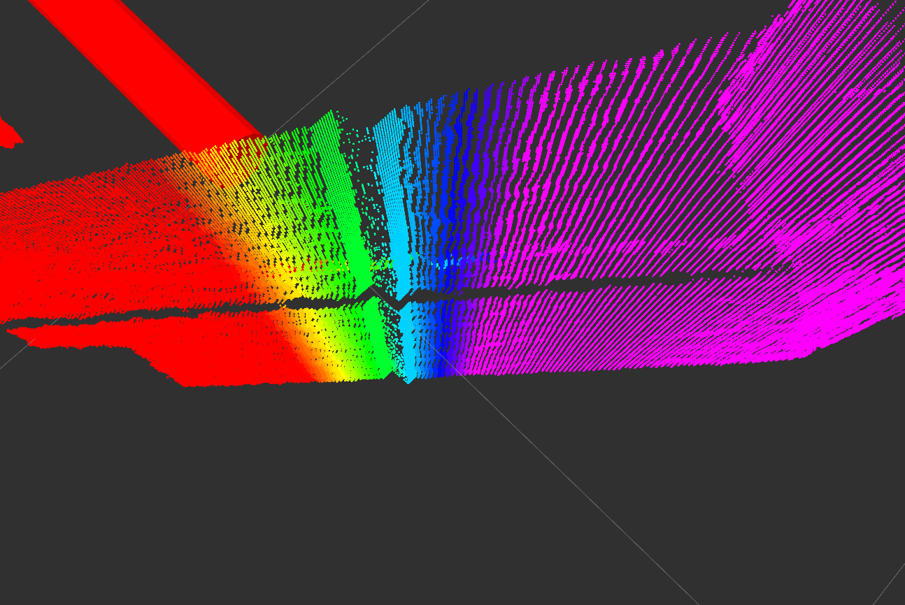
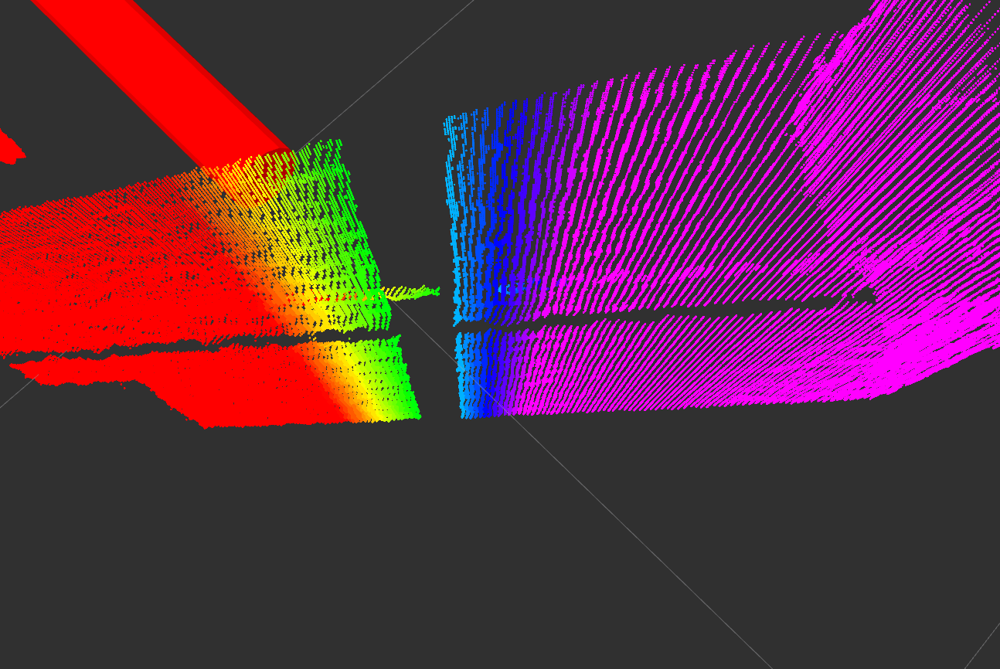
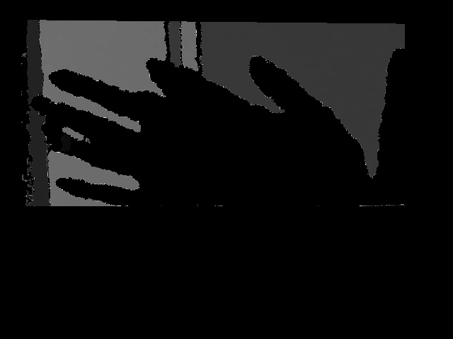
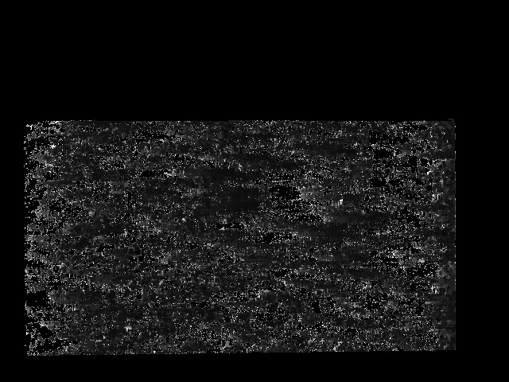
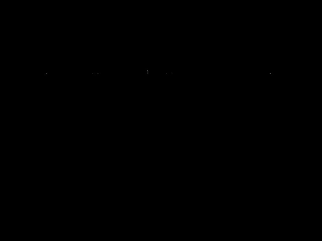
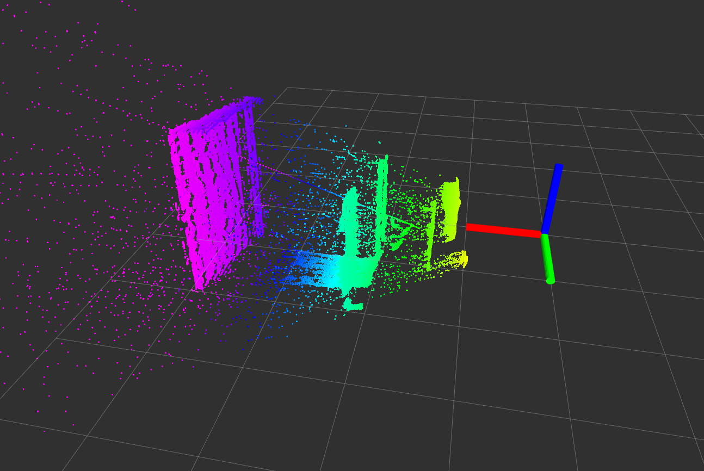
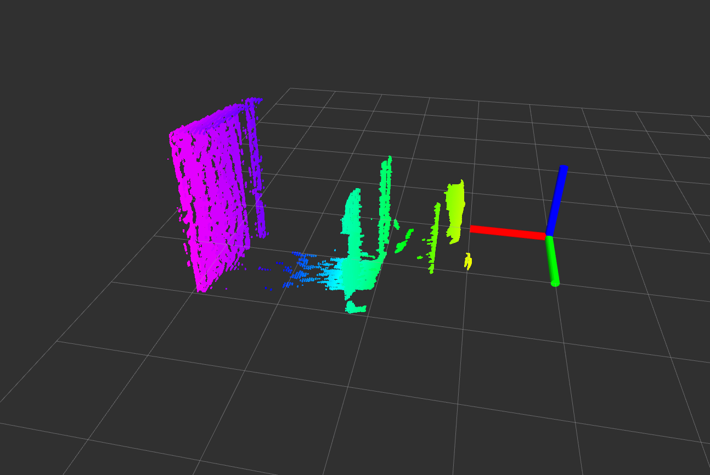

astra_depth_filters
================

The astra_depth_filters provide three filters for reducing nosie in depth images of the Orbbec Astra camera.

Artifact filter
---------------
The simplest of the three removes the noisy ridge that occurs at depth values between 1.287 and 1.327. 

   

Noise filter
---------------

This filter is designed to remove the noise occuring when objects are directly in front of the camera.
It will mark all rows below a certain point as invalid if 3 (min_noise_rows) consecutive rows contain at least a certain (diff_thresh) level of noise. 

Noise at semi-close range:

  

Noise at close range:

   

Depth filter
---------------

This mighty tool is designed to remove noise occuring at edges. This noise is especially intense if the driver is compiled with option DFILTER=OFF and launched with depth_registration:=true.
The filter will detect edges in the input image and dilate them. Of all resulting edge pixels the filter will determine how many similar pixels are nearby. If that number is below a certain threshold the pixel will be marked as invalid.

  

ROS API
-------

All topics subscribed to and published are of type [sensor\_msgs/Image](http://docs.ros.org/api/sensor_msgs/html/msg/Image.html).

For all of these filters, the image encoding is set to match the images coming directly from the astra driver.

The image encoding is either CV_32FC1 for depth_registered/image_raw or CV_16UC1 for depth/image_raw.

Invalid pixels will be either set to zero (depth) or NaN (depth_registered).

### __artifact_filter__

#### Subscribed Topics

`image_raw_unfiltered`  

- The image coming from the astra driver nodelet.

#### Published Topics

`image_raw_artifactfilter`

- The published image with all depth values between 1.287 and 1.327 marked as invalid.

#### Parameters

##### Dynamically Reconfigurable Parameters

See the [dynamic\_reconfigure](http://wiki.ros.org/dynamic_reconfigure)
package for details on dynamically reconfigurable parameters.

`~enable` (`bool`, default: True)

- Enables/Disables this feature..duh.

`~min_z` (`int`, default: 1287)

- The lowerbound limit of the interval which will be marked as invalid (in mm).

`~max_z` (`int`, default: 1327)

- The upperbound limit of the interval which will be marked as invalid (in mm).

### __noise_filter__ 

#### Subscribed Topics

`image_raw_artifactfilter`  

- The image coming from the beloved artifact_filter.

#### Published Topics

`image_raw_noisefilter`

- The published image with noisy rows marked as invalid.

#### Parameters

##### Dynamically Reconfigurable Parameters

See the [dynamic\_reconfigure](http://wiki.ros.org/dynamic_reconfigure)
package for details on dynamically reconfigurable parameters.

`~enable` (`bool`, default: True)

- Enables/Disables this feature. Yes, really!

`~min_noise_rows` (`int`, default: 3)

- The number of consecutive noise rows after which they and all rows below will be marked as invalid.

`~diff_thresh` (`int`, default: 70000)

- The threshold which determines the level of noise a row must contain in order to be marked as invalid.

`~add_rows` (int, default: 5)

- Number of rows above detection that will be removed.

### __depth_filter__

#### Subscribed Topics

`image_raw_noisefilter`  

- The image coming from the noise_filter.

#### Published Topics

`image_raw`

- Finally! As if nothing ever happened. The image_raw will be published by the depth_filter instead of the astra driver, with all the magic done.

#### Parameters

##### Dynamically Reconfigurable Parameters

See the [dynamic\_reconfigure](http://wiki.ros.org/dynamic_reconfigure)
package for details on dynamically reconfigurable parameters.

`~enable` (`bool`, default: True)

- I wonder what this does...?

`~similar_filter` (`bool`, default: True)

- Enables/Disables further filtering through similar pixels

`~filter_threshold` (`int`, default: 500)

- Threshold for the Laplace edge detection

`~laplace_kernel_size` (`int`, default: 1)

- The kernel size for Laplace filter. If it is set to 1, openCV will use a 3x3 matrix to convolute the image.

`~dilate_struct_size` (`int`, default: 3)

- Size of structuring element for dilation.

`~dist_thresh` (`int`, default: 20)

- Threshold for distance between pixels to count as similar.

`~similar_thresh` (`int`, default: 3)

- Number of similar pixels needed in order to be taken into the final image.

------------------------------------------------------------------------

